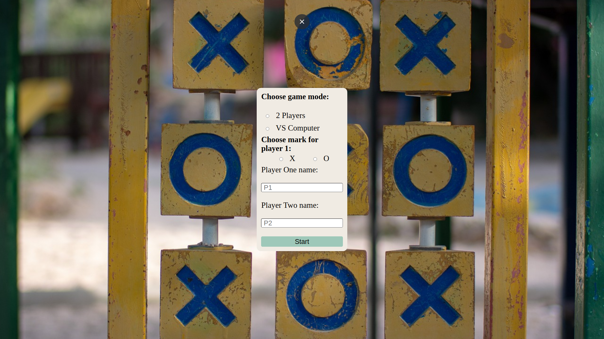
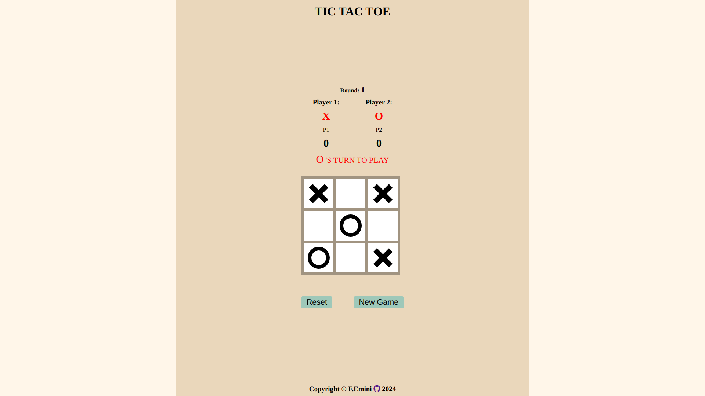

# Tic-Tac-Toe

## Description
Tic-Tac-Toe is a simple web-based game where two players take turns marking spaces in a 3x3 grid. The player who succeeds in placing three of their marks in a horizontal, vertical, or diagonal row wins the game. 
This project implements the classic Tic-Tac-Toe game with options for playing against another player or against the computer.
This project is part of The Odin Project's curriculum.

## Preview

## Live Demo
Check out the live demo [HERE](https://fatbardheminii.github.io/tic-tac-toe-TOP/).

## Usage
1. Choose the game mode (2 Players or VS Computer) and mark (X or O) for Player One.
2. Enter the names of the players (optional).
3. Click the "Start" button to begin the game.
4. Take turns marking spaces on the board.
5. The game automatically switches turns between Player One and Player Two or between Player One and the computer (if playing against the computer).
6. The game ends when one player wins or when the board is full (resulting in a draw).
7. Use the "Reset" button to reset the game while playing or after the result.
8. Use the "New Game" button to start a new game.
9. Use the "Next Round" button to start a new round after the result.

## Features
- Play against another player or against the computer.
- Choose your mark (X or O) for Player One.
- Enter custom names for Player One and Player Two.
- Simple and intuitive user interface.

## Bug Notice
**Bug:** When playing against the computer, on even-numbered rounds, the computer should make the first move. However, this functionality is currently not working. 
To overcome this issue, manually make the first move for the computer, then proceed with the first move for Player One, and then the computer will be active again.

## Contributions
Contributions to this project are welcome! Feel free to submit pull requests or raise issues for any improvements or fixes.

## Credits
- Developed by [Fatbardh Emini](https://github.com/fatbardheminii)
- Flat Icon and Font Awesome icons were used for this project
